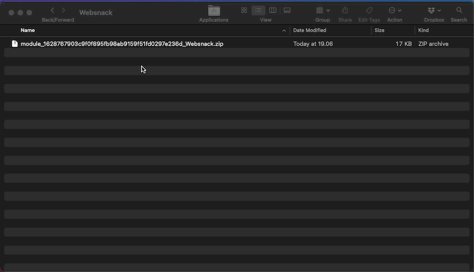

# 🛠️ Configure a Migration Module

Auto-generate a **Migration Module** visually without having to waste time editing XML-files constantly. Completely free to use.

### Information  
- PHP 7.4 
- Create directories in public folder `_temp` & `download`
- Make sure to add username/password into `auth.json` 

--- 

Get a more painless setup-process, and save yourself time, energy, and stress!